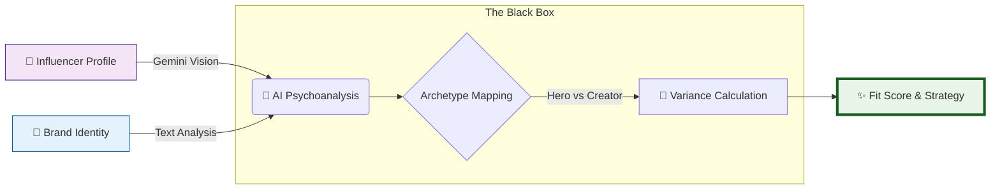

<!-- 
  Welcome to Mapfluencer! 
  This is the face of our organization. 
-->

### The "Tinder" for Brands & Creators ⚡️
**We don't match numbers. We match *vibes*.**

[🚀 **Try the Live Demo**](https://demo-mapfluencer.vercel.app) &nbsp;&nbsp; • &nbsp;&nbsp; [📖 **Read the Docs**](https://github.com/mapfluencer/demo/tree/main/docs) &nbsp;&nbsp; • &nbsp;&nbsp; [✨ **Request Feature**](https://github.com/mapfluencer/demo/issues)

---

## 🧐 What is this?

**MapFluencer** is an advanced intelligence engine that stops you from burning money on influencers who look good on paper but feel "wrong" for your brand.

We use **Google Gemini Vision AI** to psychoanalyze Instagram grids, YouTube videos, and brand manifestos, mapping them to **12 Jungian Archetypes**.

### The Problem
> **Brand:** *"We are a sophisticated 'Ruler' brand like Rolex."*  
> **Influencer:** *Posts chaotic, rebellious 'Outlaw' content.*  
> **Result:** 📉 Marketing Disaster.

### The Solution
> **MapFluencer:** *"Hey, these vibes clash. Here is a 38% Fit Score and a detailed psychological breakdown why."*

---

## 📦 What's in the Box?

We've packed this with enough AI magic to make your strategy team jealous.

| Feature | Description |
| :--- | :--- |
| 📸 **Visual Vibe Check** | Upload a screenshot. Our AI "sees" the aesthetic, color palette, and hidden psychological signals. |
| 🧠 **Psycho-Profiling** | We extract deep personality traits from raw text and images. No more "I think he's cool". |
| 📐 **Math > Feelings** | We calculate a weighted Euclidean distance between brand & creator. It's science, sort of. |
| 🕸 **Spider Charts** | Because every good data analysis needs a cool hexagonal chart. |

---

## 🔮 How the Magic Works

---

## 🎭 The 12 Archetypes We Track

We score every profile across these psychological dimensions:

| **The Soul** | **The Order** | **The Ego** | **The Freedom** |
| :---: | :---: | :---: | :---: |
| 🎨 **Creator**   *Imagination* | 👑 **Ruler**   *Control* | 🦸 **Hero**   *Mastery* | 🤠 **Outlaw**   *Liberation* |
| 🧸 **Innocent**   *Safety* | 🤲 **Caregiver**   *Service* | 🧙 **Magician**   *Power* | 🧗 **Explorer**   *Freedom* |
| 🦉 **Sage**   *Wisdom* | 🤝 **Everyman**   *Belonging* | 💘 **Lover**   *Intimacy* | 🃏 **Jester**   *Enjoyment* |

---

## 🛠 Tech Stack & Toys

We built this beast using the bleeding edge of web tech:

---

## 📸 Sneak Peek

<!-- Buraya projenin bir ekran görüntüsünü koyabiliriz, şimdilik placeholder -->

  

---

## 💬 Famous Last Words

> *"I thought my boss would be mad I spent all weekend coding this. Turns out, he just wanted to know if he matches with Elon Musk."* — **Lead Dev**

> *"Finally, a tool that explains why putting a skater punk in a luxury watch ad is a bad idea."* — **A Relieved Marketer**

---

### Ready to fix your influencer marketing?

Built with 💜 by the MapFluencer Team

