<!-- 
  Welcome to Mapfluencer! 
  This is the face of our organization. 
-->

### The "Tinder" for Brands & Creators ⚡️
**We don't match numbers. We match *vibes*.**

[🚀 Try the Demo](https://mapfluencer.app) &nbsp;&nbsp; • &nbsp;&nbsp; [📖 Read the Docs](https://github.com/mapfluencer/demo/tree/main/docs) &nbsp;&nbsp; • &nbsp;&nbsp; [✨ Join the Magic](https://github.com/mapfluencer/demo/issues)

---

## 🧐 What is this?

**MapFluencer** is an advanced intelligence engine that stops you from burning money on influencers who look good on paper but feel "wrong" for your brand.

We use **Google Gemini Vision AI** to psychoanalyze Instagram grids, YouTube videos, and brand manifestos, mapping them to **12 Jungian Archetypes**.

### The Problem
> **Brand:** *"We are a sophisticated 'Ruler' brand like Rolex."*  
> **Influencer:** *Posts chaotic, rebellious 'Outlaw' content.*  
> **Result:** 📉 Marketing Disaster.

### The Solution
> **MapFluencer:** *"Hey, these vibes clash. Here is a 38% Fit Score and a detailed psychological breakdown why."*

---

## 🔮 How the Magic Works

```mermaid
graph LR
    A[📸 Influencer Profile] -->|Gemini Vision| B(🧠 AI Psychoanalysis)
    C[🏢 Brand Identity] -->|Text Analysis| B
    
    subgraph "The Black Box"
    B --> D{Archetype Mapping}
    D -->|Hero vs Creator| E[📐 Variance Calculation]
    end
    
    E --> F[✨ Fit Score & Strategy]
    
    style A fill:#f3e5f5,stroke:#4a148c
    style C fill:#e3f2fd,stroke:#01579b
    style F fill:#e8f5e9,stroke:#1b5e20,stroke-width:4px
```

---

## 🎭 The 12 Archetypes We Track

We score every profile across these psychological dimensions:

| **The Soul** | **The Order** | **The Ego** | **The Freedom** |
| :---: | :---: | :---: | :---: |
| 🨠**Creator**   *Imagination* | 👑 **Ruler**   *Control* | 🦸 **Hero**   *Mastery* | 🤠 **Outlaw**   *Liberation* |
| 🧸 **Innocent**   *Safety* | 🤲 **Caregiver**   *Service* | 🧙 **Magician**   *Power* | 🧗 **Explorer**   *Freedom* |
| 🦉 **Sage**   *Wisdom* | 🤠**Everyman**   *Belonging* | 💘 **Lover**   *Intimacy* | 🃠**Jester**   *Enjoyment* |

---

## 🛠 Tech Stack & Toys

We built this beast using the bleeding edge of web tech:

---

## 📸 Sneak Peek

<!-- Buraya projenin bir ekran görüntüsünü koyabiliriz, şimdilik placeholder -->

  

---

### Ready to fix your influencer marketing?

Built with 💜 by the MapFluencer Team

